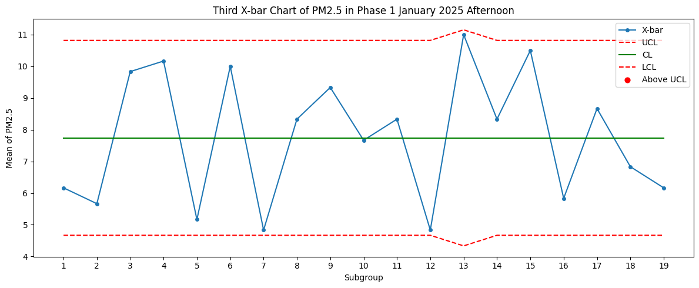
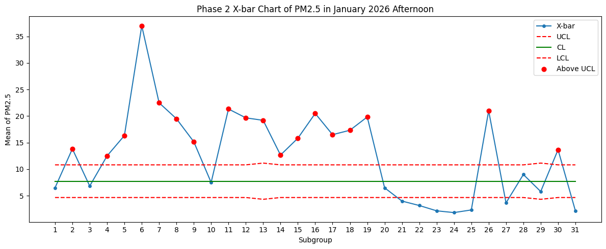
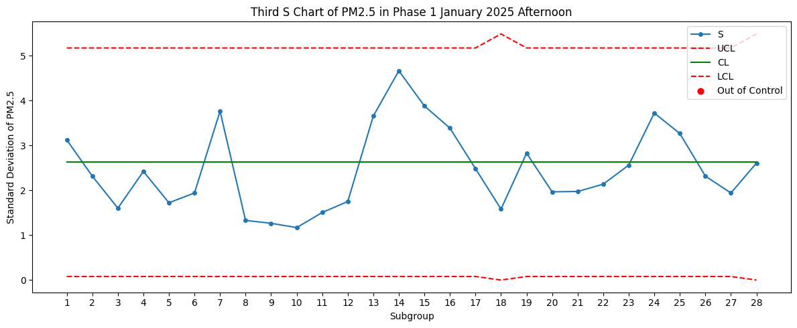
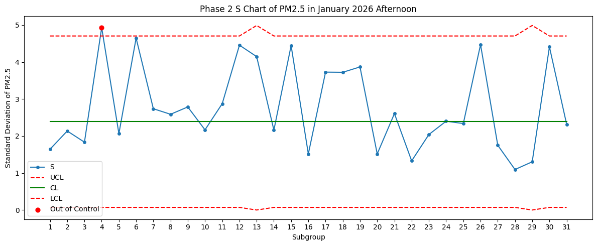
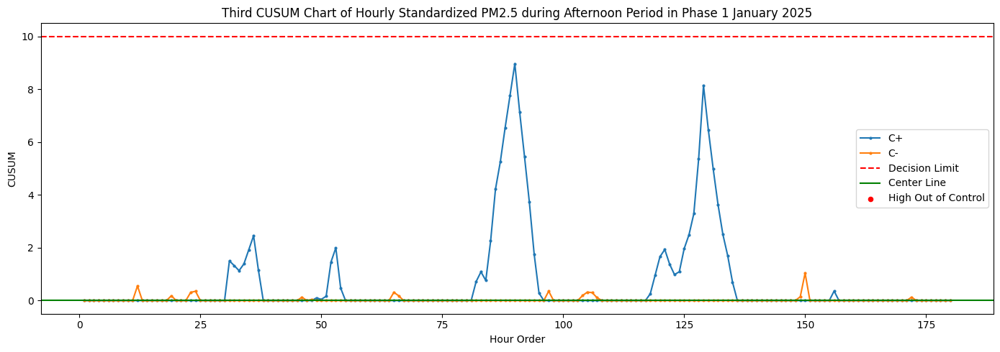
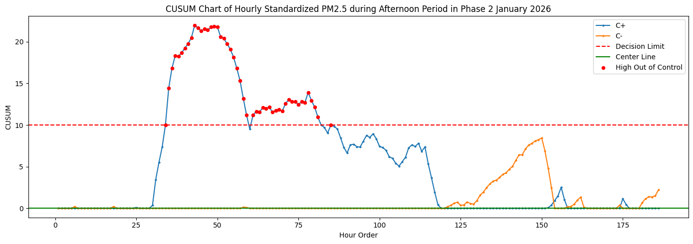
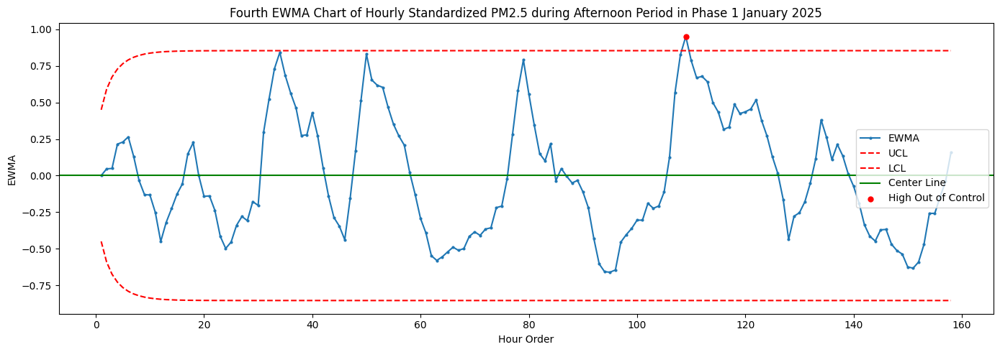
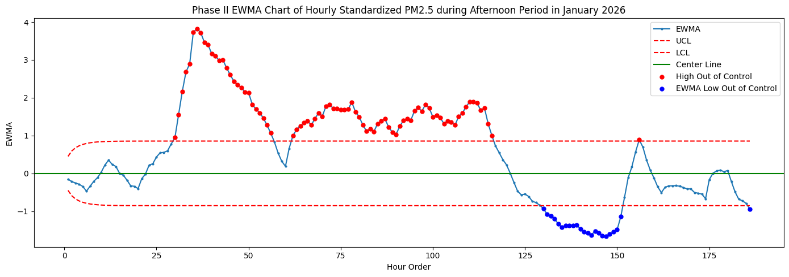
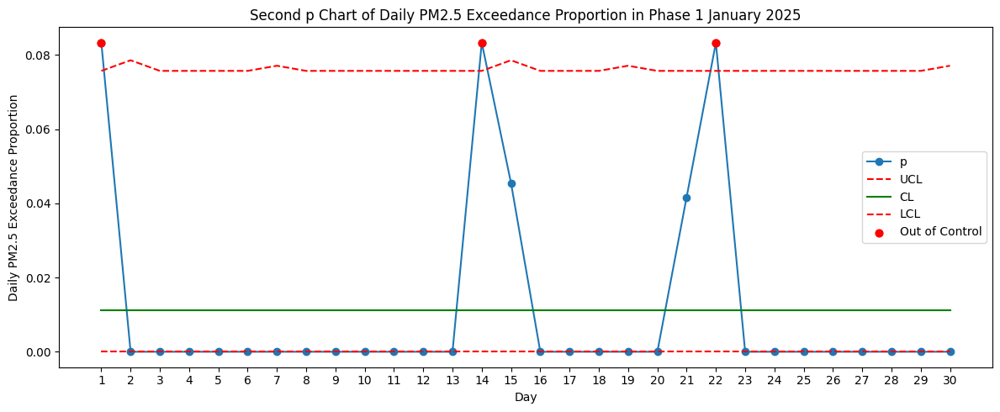
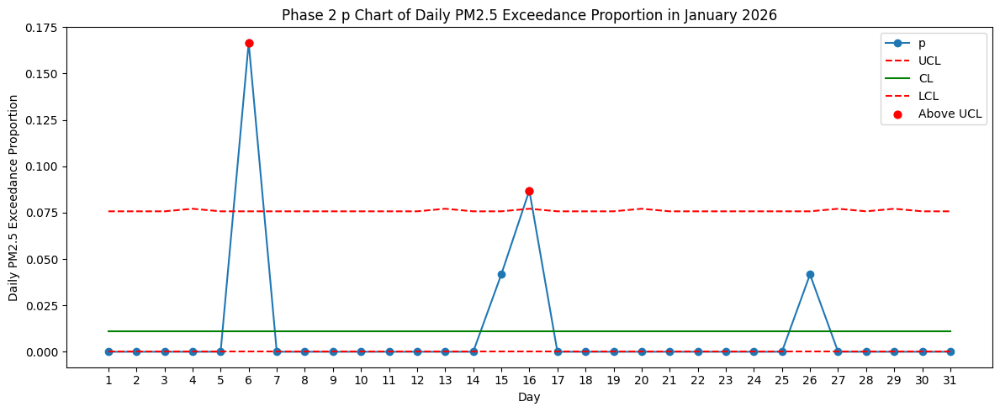

# PM2.5 Quality Control Monitoring

This project focuses on monitoring PM2.5 air quality in Taoyuan using statistical quality control methods. The analysis is divided into two phases based on different time periods.

## Project Phases

- Phase 1: January 2025 data
- Phase 2: January 2026 data

## Project Summary

### 1. Seven Basic Quality Control Tools for Taoyuan PM2.5 Analysis

The seven basic quality control tools were applied to analyze PM2.5 patterns in Taoyuan, including:

- Flowchart
- Histogram
- Check sheet
- Stratification
- Fishbone diagram
- Scatter plot
- Pareto chart

(detailed in 品管報告.pdf)

| Time Period | Number of PM2.5 Exceedance Events | Percentage (%) |
|---|---:|---:|
| Afternoon (12:00–17:00) | 4 | 50.0 |
| Evening (18:00–23:00) | 3 | 37.5 |
| Morning (06:00–11:00) | 1 | 12.5 |
| Early morning (00:00–05:00) | 0 | 0.0 |

**Key finding**: Through stratification analysis, PM2.5 exceedance events were grouped by time period. The results showed that afternoon had the highest number of exceedance events. The following control chart analysis mainly focused on **afternoon** PM2.5 data.

### 2. PM2.5 Control Chart Analysis

#### Control Chart Summary

| Control Chart | Monitoring Purpose | Key Findings |
|---|---|---|
| X-bar chart | Monitors whether the daily afternoon PM2.5 average concentration shows abnormal changes. | Abnormal upward shifts in afternoon PM2.5 average concentration were observed on several days, including 1/4–1/9 and 1/11–1/19. |
| S chart | Monitors whether the variability of daily afternoon PM2.5 concentration is abnormal. | The variability of afternoon PM2.5 concentration remained relatively stable. |
| CUSUM chart | Monitors whether the PM2.5 average concentration shows small and persistent shifts. | Afternoon PM2.5 showed a continuous upward shift during 1/6–1/10 and 1/11–1/14. |
| EWMA chart | Uses exponentially weighted moving averages to detect abnormal trends in the smoothed PM2.5 average. | PM2.5 showed a persistent upward trend during 1/6–1/10 and 1/11–1/20. |

Several statistical process control charts were used to monitor PM2.5 variation, including:

### A. X-bar and S chart

| Phase 1: January 2025 | Phase 2: January 2026 |
|---|---|
|  |  |
|  |  |

The X-bar chart was used to monitor whether the daily afternoon PM2.5 average concentration showed abnormal changes. 

In Phase 2, several days from 1/4 to 1/9 and from 1/11 to 1/19 exceeded the upper control limit, indicating that the average PM2.5 concentration was relatively high during these periods.

The S chart was used to monitor whether the variability of daily afternoon PM2.5 concentration was abnormal. 

Although the X-bar chart showed several abnormal upward shifts in the mean concentration, the S chart suggested that the variation in afternoon PM2.5 concentration remained relatively stable in Phase 2.

### B. CUSUM chart

| Phase 1: January 2025 | Phase 2: January 2026 |
|---|---|
|  |  |

For the CUSUM chart, the standardized data were used with K = 1 and H = 10. The purpose of this chart was to detect small but persistent cumulative upward shifts in PM2.5 concentration. The results showed that PM2.5 remained continuously high during 1/6–1/10 and 1/11–1/14, suggesting potential sustained upward shifts in the process mean.

In addition, air quality news during the same period was reviewed for comparison. The abnormal periods detected by the CUSUM chart were consistent with reported air quality alerts, which mentioned that the elevated PM2.5 levels may have been influenced by cold air masses and transboundary pollutants. This supports the interpretation that the CUSUM chart captured persistent high-PM2.5 signals in Phase 2.

### C. EWMA chart

| Phase 1: January 2025 | Phase 2: January 2026 |
|---|---|
|  |  |

For the EWMA chart, the standardized data were used with λ = 0.1. This chart was applied to detect abnormal changes in the smoothed PM2.5 average trend. The results indicated that PM2.5 remained persistently high during 1/6–1/10 and 1/11–1/20, showing a sustained upward trend after smoothing.

Compared with the CUSUM results, the abnormal periods detected by the EWMA chart largely overlapped with those identified by the CUSUM chart. However, the second abnormal period detected by EWMA was longer. This may be related to the use of a small smoothing parameter, λ = 0.1. With this setting, EWMA gives more weight to past observations, so even when PM2.5 gradually decreased afterward, the EWMA statistic returned to within the control limits more slowly.

### D. p chart
The p chart was used to monitor the proportion of PM2.5 exceedance events.

| Phase 1: January 2025 | Phase 2: January 2026 |
|---|---|
|  |  |

These control charts were applied to detect abnormal variations and evaluate whether the PM2.5 process was under statistical control.

### 3. Additional ARL0 Estimation

As an additional analysis, the in-control Average Run Length, ARL0, was estimated for the following control charts:

- X-bar chart
- R chart
- S chart

The ARL0 estimation was used to evaluate the expected number of samples before a false alarm occurs when the process is actually in control.
